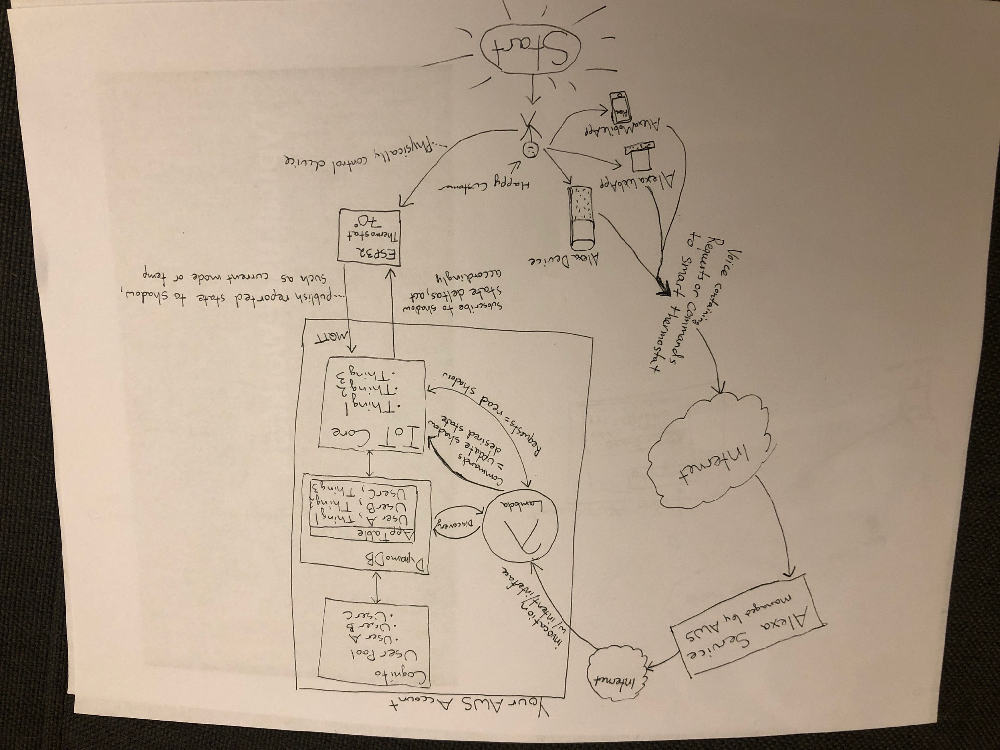

# aws-alexa-smart-home-demo

## Overview
This project shows you how to build an Amazon Alexa skill to control a thermostat using the [Alexa Smart Home API](https://developer.amazon.com/docs/smarthome/understand-the-smart-home-skill-api.html).

Whereas many Alexa examples focus only on the AWS Lambda function and dummy JSON responses sent to/from the Alexa service, this project aims to give a more complete end-to-end demo by demonstrating ways that one might use Amazon DynamoDB, AWS IoT Core, Amazon Cognito, and other services. 

A picture is worth a thousand words: 

## No Physical Devices Necessary

* **You do not need a physical Alexa device** to interact with your skill or control your thermostat. You can use the free [Alexa mobile app](https://www.amazon.com/gp/help/customer/display.html?nodeId=201602060) or [Alexa Web Console](https://alexa.amazon.com) sign up and beta test your skill. 

* **You do not need an ESP32** if you do not want to bother creating a physical device. Your Alexa skill can interact purely with the AWS IoT device shadow, and you can place dummy data into the shadow to simulate the device being online. That being said, the project is way more fun if you build the ESP32 mock thermostat, too :)

## Demo Video

This video shows the ESP32 in action by asking Alexa to change the device's state and asking it for the current temperature: 
https://www.youtube.com/watch?v=Cc9Y0D2bzJ8

## Work in process

Most of the project is done.... but there are still gaps in documentation and instructions. Please bear with me as I clean this up.

## Disclaimer

This is my first dive into AWS IoT + an Alexa skill. There are no doubt ways to do things better; some of my design choices may not be ideal. For example:

* Should I just be using IoT thing attributes to store a mapping of thing to user instead of DynamoDB?
* Is storing device configuration (e.g. capabilities) for discovery in a Lambda config file the right place to do it? 

## Prerequisites

1. AWS Account with administrative access
2. A pre-existing Amazon S3 Bucket to store CloudFormation templates (or, you can create one as you go)
3. [Node10.x](https://nodejs.org/en/download/) and [npm](https://www.npmjs.com/get-npm) (to install Lambda dependencies before uploading to AWS)
4. Optional - an ESP32 and related components, if you want to build the physical "thermostat" - [ESP32 Bill of Materials / Parts List](docs/esp32-parts-list.md)

## Deployment

**Part 1 - Alexa Skill and AWS Cloud Backend [REQUIRED]:**

1. [Create Alexa Skill and AWS Backend](./docs/01-create-alexa-skill-and-aws-backend.md)
1. [Sign up for your skill](./docs/02-sign-up-for-your-skill.md)
1. [Test your skill](./docs/03-test-skill-without-device.md)

**Part 2 - Thermostat with ESP32 [OPTIONAL]:**

4. [ESP32 First-time Setup](./docs/04-esp32-first-time-setup.md)
5. [Build your ESP32 Thermostat](./docs/05-build-esp32-thermostat.md) (See [ESP32 parts list](./docs/05a-esp32-parts-list.md))
6. [Test your skill and thermostat](./docs/06-test-skill-with-esp32.md)

## Architecture Overview

At it's core, an Amazon Alexa skill is simply an [AWS Lambda function](https://aws.amazon.com/lambda/) that gets invoked by the AWS-managed Alexa service when a user speaks to their Alexa. You create a skill in the [Alexa Developer Console](https://developer.amazon.com/alexa/console/ask) and then link it to a Lambda function in your AWS account, and your users register to use the skill via the Alexa mobile app or website. You need an OAuth identity provider (IdP) to keep track of your registered users, and for this demo we will use [Amazon Cognito](https://aws.amazon.com/cognito/).

[Custom Alexa Skills](https://developer.amazon.com/docs/custom-skills/understanding-custom-skills.html) essentially allow you to do anything you want when your Lambda function gets invoked. There are a number of [pre-made Alexa Skill Kits and APIs](https://developer.amazon.com/docs/ask-overviews/understanding-the-different-types-of-skills.html), like the [Smart Home Skill Kit](https://developer.amazon.com/docs/ask-overviews/understanding-the-different-types-of-skills.html#smart-home-skills-pre-built-model), that give you a framework for rapidly developing commonly-used Alexa skills. 

While you could build a smart home thermostat skill from scratch, we will use the Alexa Smart Home Skill Kit's [Thermostat Controller Interface](https://developer.amazon.com/docs/smarthome/build-smart-home-skills-for-hvac-devices.html) and [Temperature Sensor Interface](https://developer.amazon.com/docs/device-apis/alexa-temperaturesensor.html) to speed up the development process and remove a lot of guesswork. 

We will use [AWS IoT Core](https://aws.amazon.com/iot-core/) to create a `thing`, which is a logical representation of a physical device. Even if you do not build the optional ESP32 thermostat in this project, this project allows you to interact with your IoT `thing` as if it were a physical device.

A core component of our project is the IoT thing's [device shadow](https://docs.aws.amazon.com/iot/latest/developerguide/iot-device-shadows.html), which is a JSON document managed by the AWS IoT Shadow Service that keeps track of the current device state, aka `reported state`, sent by our physical device (if used), and the `desired state` which we can change in the cloud manually, via an application, or - in this case - via interaction with Alexa. The shadow is a powerful feature that allows us to 'queue' messages or commands for our device when connectivity is lost. If our device is disconnected and we change the desired state in the shadow such that it doesn't match the last known reported state, the shadow service will notify the device of the difference between reported and desired state as soon as the device reestablishes a connection to the cloud. With a device shadow, we can decouple the remote control of our device with need for internet connectivity. 

We need to maintain a mapping between your skill's users (stored in Cognito) with their registered thermostats (stored in AWS IoT Core). There are number of places and ways this mapping could be stored, but for this project, we have opted to use [Amazon DynamoDB](https://aws.amazon.com/dynamodb/), a fully-managed NoSQL key-value database.

## User Stories

Example user stories are described in the following sections. I am **not** an IoT or Amazon Alexa expert, so understand these are not perfect examples and may have some mistakes or ommissions. 

The users in our story are: 

1. **SmartCompany** - Company that owns and sells the smart home thermostat. 
2. **Manufacturer** - the manufacturer of the physical thermostat. This could be SmartCompany or a third-party manufacturer. 
3. **Alexa Service** - the Alexa Cloud Service, owned and operated by Amazon Web Services (AWS).
4. **Alexa** - "Alexa" will refer to the any Alexa device, such as an Amazon Echo, or the Alexa web or mobile app. 
4. **Customer** - buyer of SmartCompany's thermostat; will use their own previously-purchased Alexa-enabled device (e.g. an Amazon Echo) or the Amazon Alexa mobile app or website to interact with SmartCompany's Alexa skill. 

### SmartCompany Creates an Alexa Skill and Application Backend

2. SmartCompany creates a new Smart Home skill in the [Alexa Developer Console](https://developer.amazon.com/alexa/console/ask)
3. SmartCompany builds an AWS Lambda function to interact with commands or requests from the Alexa Service 
4. SmartCompany builds an Amazon Cognito user pool to act as the identity provider (IdP) for their skill
5. SmartCompany links their Alexa Smart Home Skill with their AWS Lambda function and Amazon Cognito user pool

We will use AWS CloudFormation to deploy and configure most of this story; some manual steps are needed to create the Alexa skill and link it to your AWS backend. 

### Manufacturer Builds Device and Embeds AWS IoT Certificate for Authentication

1. SmartCompany engages Manufacturer to build their thermostat.

2. Manufacturer obtains an AWS IoT device certificate. There are many ways to do this, some examples are below: 

    * SmartCompany pre-provisions certificates in AWS IoT Core and provides them to Manufacturer

    * SmartCompany builds a "certificate vending machine" (aka CVM) and gives Manufacturer access to use/invoke the CVM. As an example, the AVM could be an AWS Lambda function accessed via an Amazon API Gateway.

    * SmartCompany registers a Certificate Authority (CA) with AWS IoT Core and gives the CA to the Manufacturer; the Manufacturer may now generate certificates itself and embed them on the device; these certificates can be automatically registered with AWS IoT Core using a [just-in-time registration (JITR) strategy](https://aws.amazon.com/blogs/iot/just-in-time-registration-of-device-certificates-on-aws-iot/) or the easier [just-in-time provisioning process (JITP)](https://aws.amazon.com/blogs/iot/setting-up-just-in-time-provisioning-with-aws-iot-core/).

    * Manufacturer has their own CA which they give to SmartCompany, and SmartCompany registers as a custom IoT CA within their AWS account; Manufacturer provisions and embeds their own certificates into the devices and, through the JITR/JITP processes, the devices can register within SmartCompany's IoT registry when they first connect. The initial registration might only allow the devices to connect but not do anything else. Then, Manufacturer gives a list of the trusted certificates they generated to SmartCompany, and SmartCompany swaps the certificate policy for those certs with a more permissive cert that allows the devices to become functional (e.g. publish or subscribe to topics).

3. At some point, SmartCompany creates an AWS IoT `thing` in the AWS IoT device registry to act as a logical representation of the physical thermostat. An IoT 'thing' is needed to use advanced AWS IoT Core features such as the device shadow. Similar to the device certificates, the thing may be created in a number of ways and at different times. Regardless of how and when, typically the thing attributes in IoT Core would contain essential information such as device serial number, model number, firmware version etc.

4. Manufacturer ships device to SmartCompany and/or retail locations, 3rd-party distributors, etc. for eventual purchase by customer.

In our demo, the project's CloudFormation template will create an AWS IoT thing for us. If you build the optional ESP32 mock thermostat, you will manually generate certificates in the AWS IoT web console, download them, and flash them to the ESP32.

### Customer Buys SmartCompany's Thermostat and Signs Up for their Alexa Skill

1. Customer buys SmartCompany's thermostat and brings it home

2. Customer registers their thermostat with SmartCompany's application backend. There are many ways to do this, with one common approach being the Customer uses a mobile app developed by SmartCompany to provide WiFi credentials to the thermostat make an API call to SmartCompany's back-end to associate the device to the customer. The registration should be done with the same identity provider (IdP) that SmartCompany linked to their Alexa skill.

3. During the registration process, SmartCompany's backend should now know the Customer's IdP user ID and, either directly or indirectly via the device's serial number, it's AWS IoT thing name. Using this information, the backend should create an association between the AWS IoT thing and the IdP user ID. 

3. Customer then downloads/installs SmartCompany's Alexa skill on their Alexa-enabled device (e.g. an Amazon Echo) or via the free Alexa mobile or web app. 

4. Customer uses the Alexa web or mobile app to sign in to SmartCompany's Alexa skill using same credentials from Step 2.

In our demo, we will sign up for our Alexa skill using the Alexa mobile app from Amazon, as this is much easier than building a full-fledged registration app / website ourselves. After signup, we will manually create an associate between our device's IoT thing and our user's Cognito user ID by adding an entry into a DynamoDB table. 

### Customer Discovers Devices Compatible with SmartCompany's Alexa Skill

Even though SmartCompany's AWS backend has an association between customers and their devices, e.g. in a DynamoDB database, remember that the Alexa Service is separately owned and maintained by AWS. Therefore, the Alexa Service must ask SmartCompany for a list of device(s) owned by a given a customer. The customer must explicitly initiate this via the discovery process: 

1. Customer asks their Alexa device (or Alexa web/mobile app), "Alexa, discover devices"

2. The Alexa device sends the audio request to the Alexa Service

3. The Alexa service uses machine learning (ML) to convert the audio to an intent; in this case, it understands that a "Discovery" intent has been requested. 

4. The Alexa service invokes SmartCompany's AWS Lambda function with a "Discovery" intent and the customer's IdP user ID in the payload. 

5. The Lambda function queries SmartCompany's AWS backend application to ask for a list of devices belonging to the customer. 

6. The Lambda function sends the list of device(s) back to the Alexa Service; these device(s) are remembered by the Alexa Service and referred to as `endpoints` from here onward. 

7. The Alexa Service sends an audio response back to the Alexa device containing a message as to which endpoints, if any, were discovered. 

8. The Alexa device says something such as "I discovered XYZ device"

9. The Customer may now interact with discovered endpoints and will also see them appear in the list of devices in the Alexa web or mobile app. 

In our demo, we will cover this use case as described. In our case, we have a DynamoDB table that maintains the list of device(s) associated to a given user's Cognito user ID (partition key = userID, sort key = AWS IoT Thing name). The Lambda function will obtain the device's serial number, model number, and firmware version from the IoT thing's attributes and use that info to look up the device's Alexa capabilities against a configuration map stored as part of the Lambda's code. It will use this information to form the proper response to the Alexa Service. 

### Customer Interacts with Smart Thermostat by Speaking to Alexa

1. Customer interacts with their smart thermostat by speaking to Alexa; example utterances include:

    * "Alexa, what is the temperature of my smart thermostat?"
    * "Alexa, set my thermostat to COOL"
    * "Alexa, set my thermostat to HEAT"
    * "Alexa, set my thermostat to OFF"
    * "Alexa, set the temperature to 70 degrees"
    * "Alexa, increase the temperature"

2. In all cases, the user's Alexa device (or web/mobile app) will send the request to the Alexa Service.

3. The Alexa Service will determine which Smart Home API the user is requesting (e.g. get temperature, or set mode) and send that request to SmartCompany's Lambda function; the request will also include the customer's user ID and endpoint ID. Note that the Alexa Service keeps a mapping between SmartCompany's internal endpoint ID and the device name spoken by the user. SmartCompany must define a default name for their device during the discovery process, but the Customer can always change it in the Alexa app. 

4. In the case of the user asking for information, such as current temperature, the Lambda function will typically read this from the device's last reported state in the AWS IoT Core device shadow. 

5. In the case of the user directing the device to do something, such as change the mode or target temperature, the Lambda function will typically update the `desired state` in the device shadow; if the device is online, or when it next reconnects, the shadow service will send a `shadow delta` message to the device if the reported and desired states do not match. The device's application logic should have code that works to resolve the delta by changing desired state to match reported state.

## Cost

On the AWS side of things, everything we do should cost near-zero (maybe pennies a month). I haven't calculated exact costs, but the [AWS Free Tier](https://aws.amazon.com/free/) covers a lot. As of this writing (July 2019), the "always free tier" provides more than enough usage to cover: 

* AWS Lambda (1 million invocations / month)
* Amazon Cognito (50,000 user pool actions / month)
* Amazon DynamoDB (25 GB of storage, 25 RCU & 25 WCUs equivalant to 200M requests per month)

The free tier also includes 12 months of free usage for certain services, including but not limited to: 

* AWS IoT (250K published or delivered messages per month)

Even if outside of the free tier usage, everything we are using will be pay-as-you-go based on actual usage, which should amount to mere pennies a month. That being said, remember you are responsible for watching your cost and usage. 
