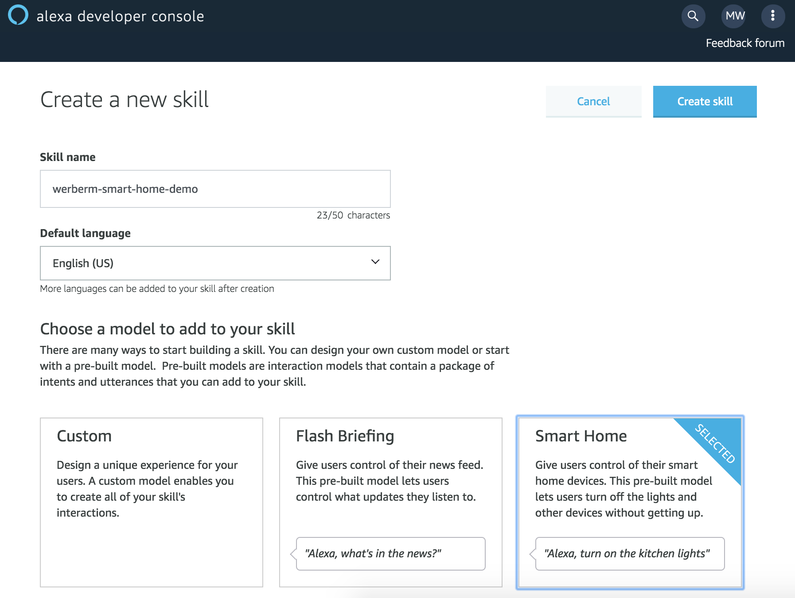
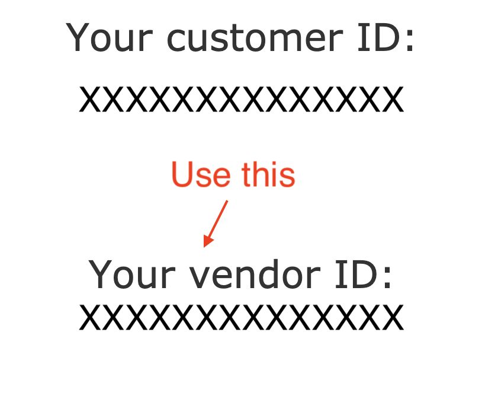
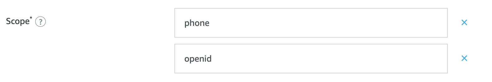

# Part 1 - Create Alexa Skill and AWS Cloud Backend Infrastructure

First, we create our Alexa Smart Home Skill in the Amazon-managed Alexa Service and our smart home application infrastructure in our AWS account. We connect the two components by giving the Alexa Cloud permission to invoke a Lambda function within our AWS account and by giving the Lambda function permission to send responses to our skill in the Alexa Cloud:

1. Register a developer account with the [Alexa Developer Console](https://developer.amazon.com/). Note that the **email address** you use should match the email address you later plan to test your skill with. You could optionally complete additional steps to open up testing to others, but this demo does not cover that and focuses on testing by one user (you). 

2. Navigate to the [Alexa Skills Kit (ASK) Dashboard](https://developer.amazon.com/alexa/console/ask) and click **Create Skill**.

3. Give your skill a name, such as **alexa-smart-home-demo** and select **Smart Home** as the skill model. 

   <kbd></kbd>

4. Click **Create Skill**. You will be taken to a configuration page. We need to first create additional resources before we use their values to complete this page. For now, copy your **Skill ID** (e.g. `amzn1.ask.skill.xxxxxxx-xxxx-xxxx-xxxx-xxxxxxxxxxxx`) into a text editor. You will need this value later.

5. Navigate to [https://developer.amazon.com/settings/console/mycid](https://developer.amazon.com/settings/console/mycid) and copy your **Alexa Vendor ID** into your text editor, along with your Skill ID. Be sure to use your `Vendor ID`, **not** your `Customer ID`:

    <p align="center">
        <kbd></kbd>
    </p>
    
6. Open **deploy.sh** and enter your Alexa skill ID and vendor ID into their corresponding variables. Note, these values are considered secrets so you would not normally commit these to source in a production environment; you instead may want to manage them with a secrets manager like [AWS Secrets Manager](https://aws.amazon.com/secrets-manager/):

    ```sh
    # deploy.sh
    ALEXA_SKILL_ID=amzn1.ask.skill.1bb2f0b3-1234-1234-1234-1234ea6b04b3
    ALEXA_VENDOR_ID=1234N12341234
    ```

7. Edit **deploy.sh** and set the `BUCKET=` variable to the name of a pre-existing S3 bucket to which you have write access. This bucket will store the artifacts used by CloudFormation to launch your stack. It's recommend that you leave the `STACK_NAME=alexa-smart-home-demo` as we will reference this stack name in later steps. 

    ```sh
    # deploy.sh
    BUCKET=your_bucket_name
    ```

8. Install the [SAM CLI](https://docs.aws.amazon.com/serverless-application-model/latest/developerguide/serverless-sam-cli-install.html). The SAM CLI provides several tools that make serverless app development on AWS easy, including the ability to locally test AWS Lambda functions. The specific functionality we will use is SAM's ability to translate and deploy short-hand SAM YAML templates ([see specification here](https://github.com/awslabs/serverless-application-model/blob/master/versions/2016-10-31.md)) into full-fledged CloudFormation templates. 

10. Build and deploy an AWS CloudFormation stack by running **deploy.sh** from the project root. This stack will create and configure the majority of this project's resources:

    ```sh
    $ ./deploy.sh
    ```

11. Monitor the status of your stack from the [CloudFormation console](https://console.aws.amazon.com/cloudformation/) and wait for the status to show as **CREATE_COMPLETE**. 

12. From the CloudFormation console, click the **alexa-smart-home-demo** stack and then click the **Outputs** section. Here, you will see a number of values that we will plug in to your skill's configuration in the Alexa Developer Console to complete our skill setup. 

13. While keeping the CloudFormation console open, open the [Alexa Developer Console](https://developer.amazon.com/alexa/console/ask/), click **Edit** next to the skill you created previously, and copy-paste (or enter) the following values:

    1. Click the **Smart Home** tab of the Alexa skill console, and: 

        1. Copy the value of the **AlexaDefaultEndpoint** output from CloudFormation into the **Default endpoint** box of the Alexa configuration:

        2. Cick **Save**

    2. Click the **Account Linking** tab of the Alexa skill console, and: 

        1. Copy the value of the **AlexaAuthorizationURI** output from CloudFormation into the **Authorization URI** box of the Alexa configuration. It should look like this: 

            ```
            https://012345678910-alexa-smart-home-demo-domain.auth.us-east-1.amazoncognito.com/oauth2/authorize?response_type=code&client_id=fjiejfo4pvmkdirkfhg8572d03redirect_uri=https://pitangui.amazon.com/api/skill/link/FKEN3OMDOQ12&state=STATE
            ```

        2. Copy the value of the **AlexaAccessTokenURI** output from CloudFormation into the **Access Token URI** box of the Alexa configuration. It should look like this: 

            ```
            https://012345678910-alexa-smart-home-demo-domain.auth.us-east-1.amazoncognito.com/oauth2/token?state=STATE
            ```
        
        3. Copy the value of the **AlexaClientId** output from CloudFormation into the **Client ID** box of the Alexa configuration. It should look like this: 

            ```
            fjiejfo4pvmkdirkfhg8572d03
            ```
        
        4. Click the link in the value field of **AlexaClientSecret** in CloudFormation; you will be taken to a secret in AWS Secrets Manager; scroll down and click **Retrieve secret value** and copy the value of **clientSecret** from AWS Secrets Manager into the **Client Secret** box of the Alexa configuration. 
        
        5. Select **HTTP Basic (recommended)** as the **Client Authentication Scheme** in the Alexa configuration. 
        
        6. Add **phone** and **openid** as values to the **Scope** section of the Alexa Configuration. Note - spelling and case must exactly match.  It should look like this: 

            <kbd></kbd>

        7. Leave **Domain List** and **Default Access Token Expiration Time** blank. 
        
        8. Click Save.

## Next Steps

Proceed to [Step 2 - Sign up for your skill](./02-sign-up-for-your-skill.md).