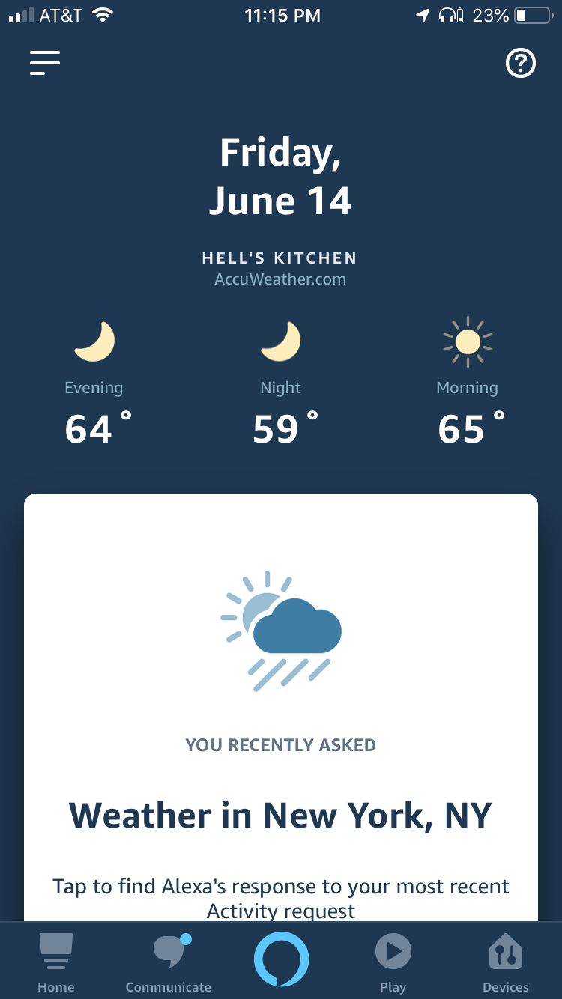
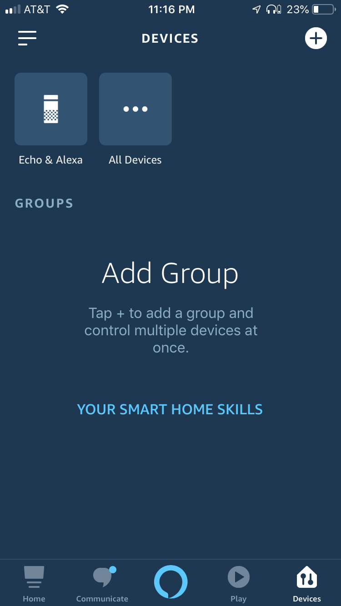
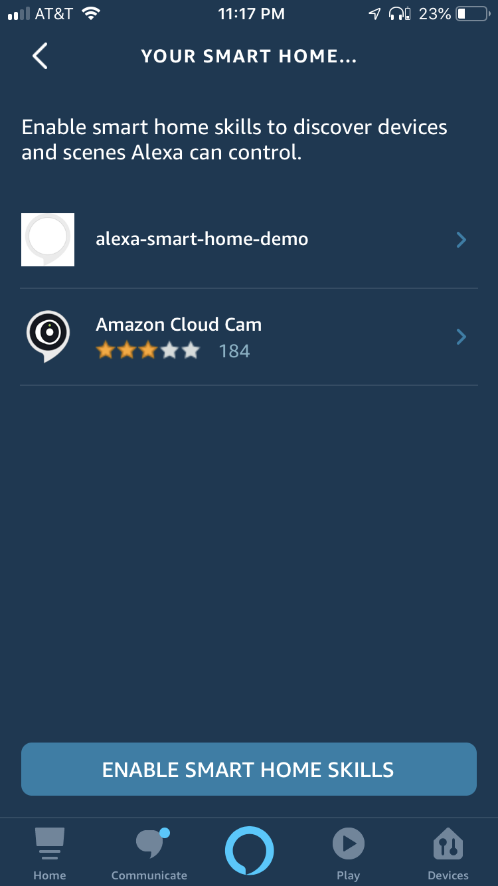
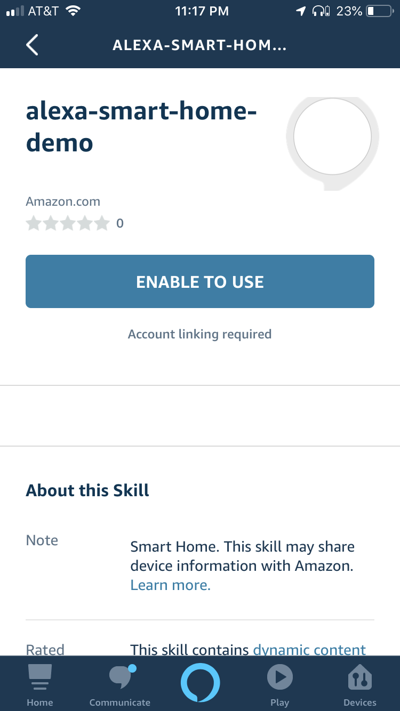
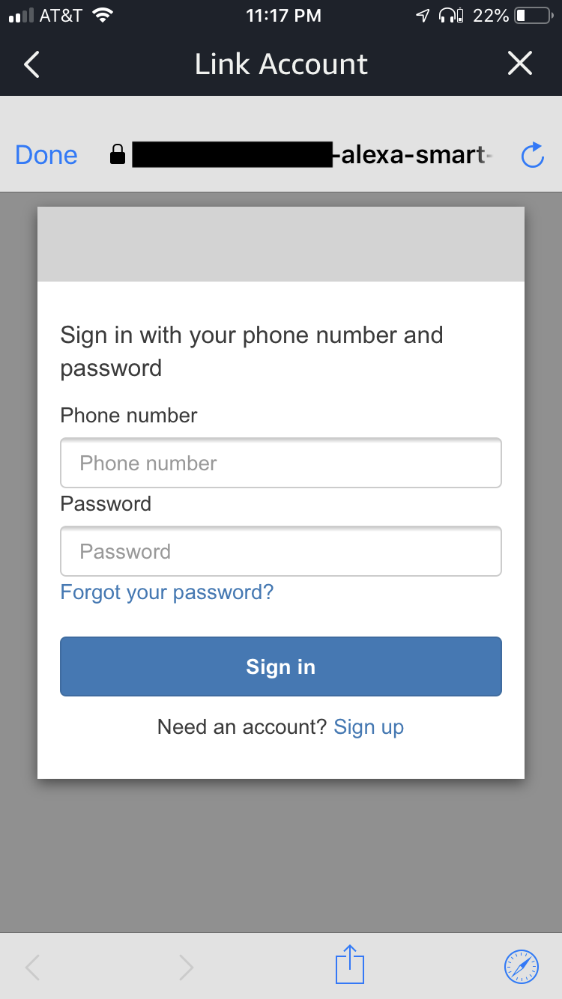
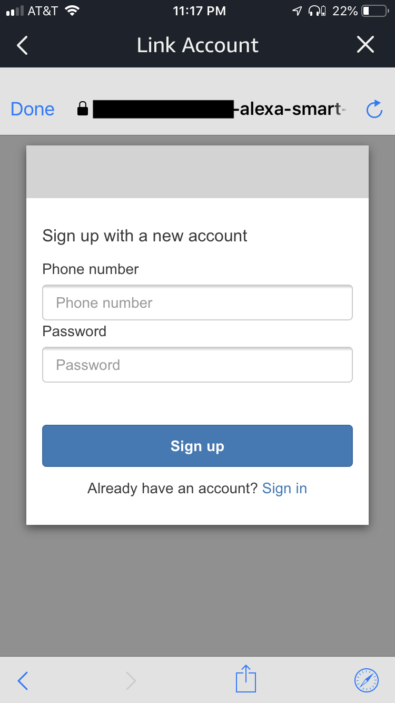
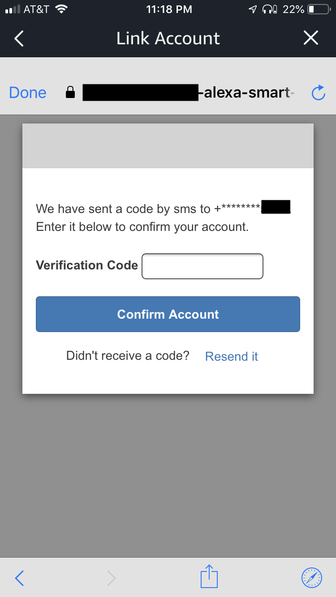
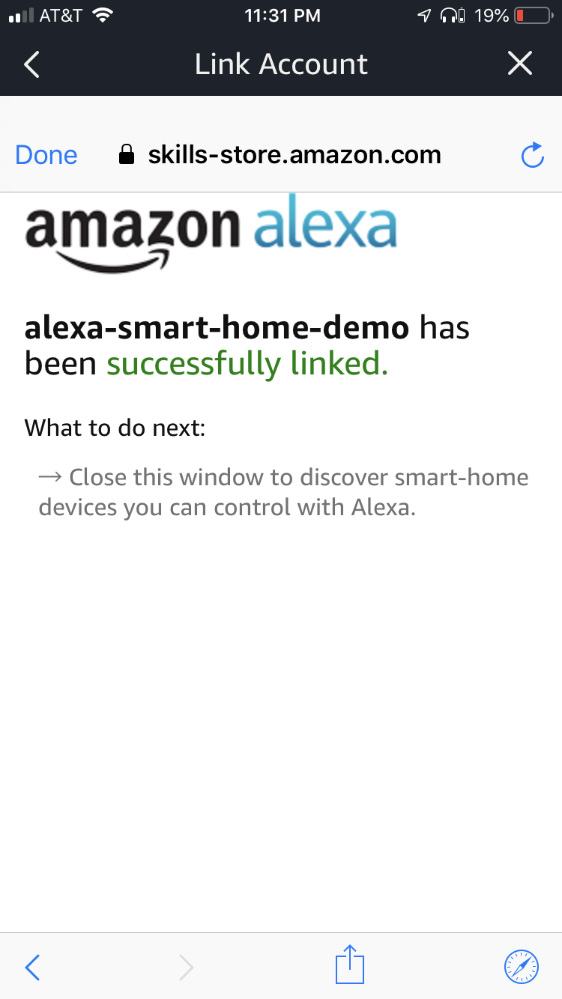
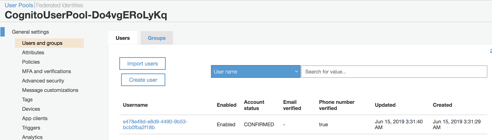

# Sign up for your Alexa Skill

Here, we will play the role of smart home customer by registering to use our thermostat skill with Alexa. We will then "map" our AWS IoT thing to our new user ID and finally run the Alexa discovery process to allow Alexa to interact with our device.

## Sign up

Now that our skill and backend cloud infrastructure exists, we can now sign up to use the skill:

1. Install the Amazon Alexa app ([Android](https://play.google.com/store/apps/details?id=com.amazon.dee.app&hl=en_US), [iOS](https://itunes.apple.com/us/app/amazon-alexa/id944011620?mt=8)) and sign in **using the same email address** that you used to create your Alexa skill. Alternatively, you may follow the [Alexa Beta Tester Guide](https://developer.amazon.com/docs/custom-skills/skills-beta-testing-for-alexa-skills.html) to invite others to use your skill.

2. Open the Alexa app and click **Devices** in the lower right:

    

3. Click **Your Smart Home Skills** in the middle of the screen:

    

4. You should see a skill named **alexa-smart-home-demo** (or, whatever name you used when creating your skill in the Alexa Developer Console). If you do not see your skill, ensure that you are signed in to the Alexa app using the same email you used in the Alexa Developer Console or using an email that you sent a beta invitation to. Click the skill name: 

    

5. Click **Enable to use**:

    

6. You will be brought to a sign-in screen. Click **sign up**:

    

7. Sign up for your skill with your mobile number (for US numbers, must be in the format "+1xxxyyyzzzz"):

    

8. You will receive a verification code via SMS text. Enter that code to complete the sign-up process:

    

9. You should be greeted with a **successfully linked** message:

    


## Map our Skill's User ID (from Cognito) to our AWS IoT Thing

At this point, we need to link your new app user ID (from Amazon Cognito) to the demo AWS IoT thing we created for you previously in the Part 1 CloudFormation Template. Normally, a device manufacturer would have some process to do this for us (e.g. a web or mobile app), but we will manually create this association by adding it to a DynamoDB table used by our skill's Lambda function. The Lambda will query this table to find the device(s) owned by our user. 

Proceed as follows: 

1. Navigate to the [Cognito user pool console](https://console.aws.amazon.com/cognito/users) and click the user pool with a name like `CognitoUserPool-XXXXXXXXXXXX`, click the **Users and groups** on the left:

     <p align="center">
        <kbd></kbd>
    </p>

2. You should see only one username similar to `e478e49d-e8d9-4490-9b53-bcb0fba2f18b`, since you're app is not publically open for registration. Just to be sure, click the username and on the next page, verify that the user's phone number matches the number you used when signing up. If it matches, make note of the username; you will need this in step 5. 

3. Navigate to the [IoT thing list](https://us-east-1.console.aws.amazon.com/iot/home#/thinghub) and make note of the thing name that looks similar to `alexa-smart-home-demo-SmartHomeThing-1LW418RIHGL2X`; you will need this in step 5. 

4. Navigate to the [DynamoDB table list](https://console.aws.amazon.com/dynamodb/home#tables:), click the table with a name similar to `alexa-smart-home-demo-DeviceTable-1EM716Y4F5F6H`, click the **Items** tab, and click **Create item**:

    <p align="center">
        <kbd></kbd>
    </p>

5. On the create item popup window, click the top-left dropdown and change it from "Tree" to "Text", then copy paste the info below and click **Save**. Be sure to replace the user ID and thing name with your unique values from Steps 1 and 2:

    ```json
    {
        "hashId": "userId_e478e49d-e8d9-4490-9b53-bcb0fba2f18b",
        "sortId": "thingName_alexa-smart-home-demo-SmartHomeThing-1LW418RIHGL2X",
        "thingName": "alexa-smart-home-demo-SmartHomeThing-1LW418RIHGL2X",
        "userId": "e478e49d-e8d9-4490-9b53-bcb0fba2f18b"
    }
    ```

    **Note** - be sure to include the `userId_` and `thingName_` prefix in the `hashId` and `sortId` columns, but do **not** keep them in the `thingName` and `userId` columns. 

## Discover your Devices with Alexa

Now that our backend has an association between our skill's user ID and our IoT thing, we can Ask Alexa (or use the Alexa web or mobile app) to discover our devices. The examples below show the mobile app, but you could just as easily ask your Alexa device "Alexa, discover devices".

1. Click **Discover Devices** to have the Alexa Cloud invoke your skill's Lambda function to search for and tell Alexa which device(s) are registered to your account: 

    

2. If Alexa says/shows that a new device was discovered, you can proceed. You can also verify that the proper device was added  by viewing the list of your smart home devices from within the Alexa web or mobile app and confirming a new "Smart Thermostat" device is listed. 

## Next Steps

Proceed to [Step 3 - Test your skill](./03-test-skill-without-device.md).