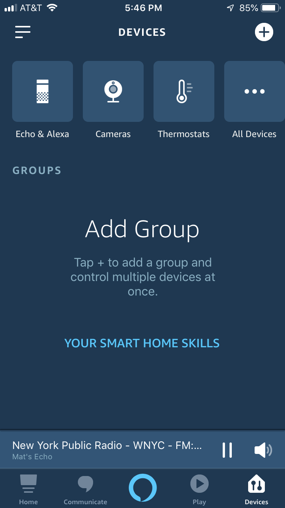
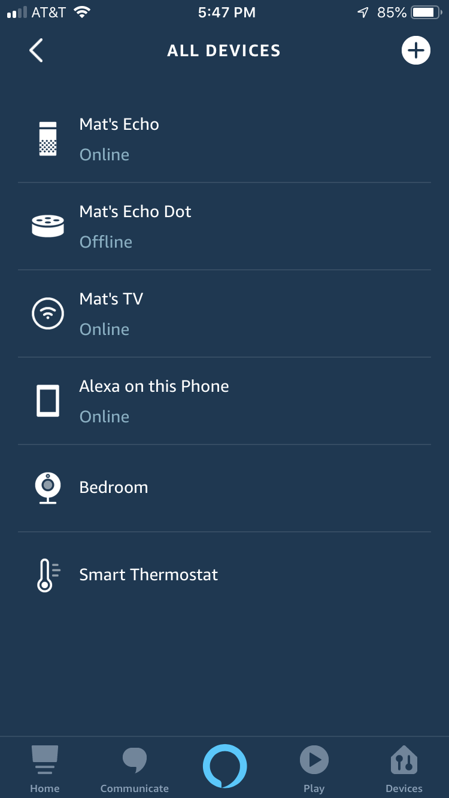
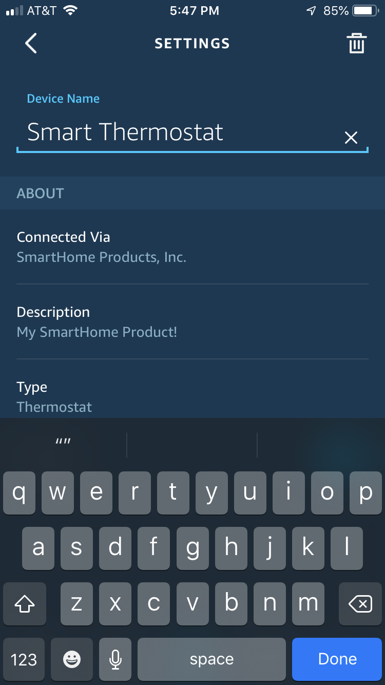
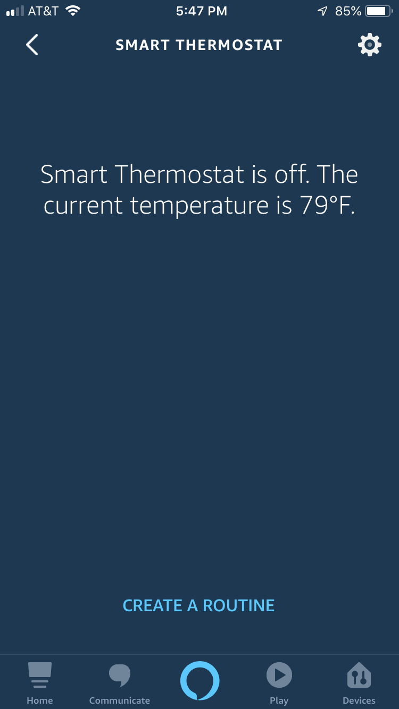
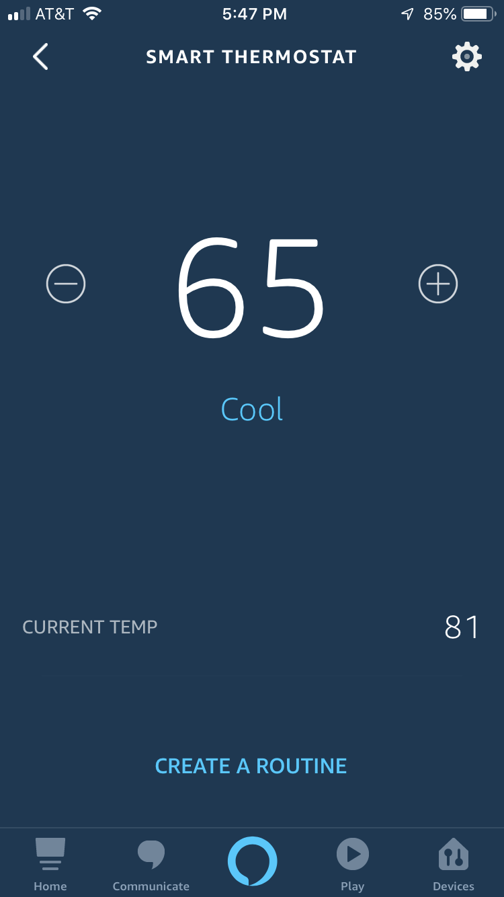
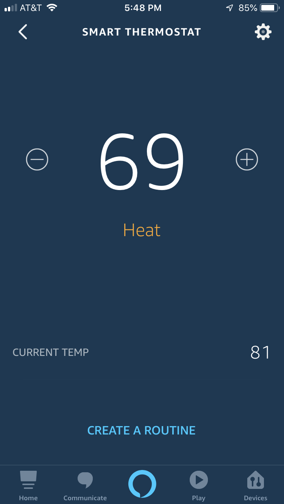

# Test Your Alexa Skill (without a device)

Note - at this stage, we've created the backend but there is no physical device. Therefore, we must hard-code a **reported state** into our AWS IoT thing's shadow to make it look like a physical device is connected and reporting state. When the Alexa service invokes our Lambda to ask about current state (e.g. temperature, current heating or cooling mode, etc.), our Lambda will read from this shadow.  

1. [Click here to open the AWS IoT Things window](https://us-east-1.console.aws.amazon.com/iot/home#/thinghub), and click thing with a name like `alexa-smart-home-demo-SmartHomeThing-XXXXXXXXXXX`, click **Shadow** on the left nav bar, click **Edit**, paste the info below, and click **Save**: 

    ```json
    {
        "reported": {
            "temperature": {
                "scale": "FAHRENHEIT",
                "value": 77
            },
            "thermostatMode": "COOL",
            "targetSetpoint": {
                "value": 60,
                "scale": "FAHRENHEIT"
            },
            "connectivity": "OK",
            "deviceType": "AlexaSmartHomeDemo"
        }
    }
    ```

2. Talk to your Alexa device (an Echo, Alexa mobile app, etc.) to test the following: 

    * "Alexa, set thermostat to COOL"
    * "Alexa, set thermostat to OFF"
    * "Alexa, what is the thermostat temperature?"
    * "Alexa, set the thermostat to 65 degrees"
    * "Alexa, set increase the thermostat temperature"

    If you ask Alexa for information, your skill's Lambda function will read the the info (e.g. temperature) from the device's last reported state in the IoT device shadow. If you instruct Alexa to adjust your thermostat, the Lambda function will update the device's desired state in the device shadow.

3. You can also use the Alexa mobile app's built-in thermostat interface to view and interact with your device:

    * From the Devices, screen, tap **All Devices**:
    
        

    * You should see a device named **Smart Thermostat**:
    
        
    
    * Note that you may optionally edit the thermostat's name:

        
    
    * This is what you will see if the device is connected (`{state: { reported: { "connectivity": "OK" } } }`) but thermostat mode is off (`{state: { reported: { "thermostatMode": "OFF" } } }`):

        
    
    * This is what you will see if the device is connected and the thermostat mode is set to "COOL":

        

    * This is what you will see if the device is connected and the thermostat mode is set to "HEAT":

        


## Next Steps

Proceed to [Step 4 - First Time Setup of Your ESP32](./04-esp32-first-time-setup.md).