# Build a (mock) Smart Thermostat with an ESP32

In this optional section, we will wire up an ESP32 to act as a mock thermostat connected to our AWS backend. 

## Key Components
 
* **Red and blue LEDs** used to indicate that thermostat is in HEAT or COOL mode, respectively
* **White LED** to indicate that the device is successfully connected to your AWS IoT Core cloud backend
* **DHT11** temp/humidity sensor from which the device will take readings and send to AWS IoT
* **Push-button** to allow the user to physically change the thermostat between HEAT, COOL, and OFF

## Bill of Materials

Refer to the [ESP32 Thermostat bill of materials (BOM)](./05a-esp32-parts-list.md) for the components needed to build your mock device.

## Wire up your ESP32

The instructions and images below assume you are using the exact same ESP32 dev board that I listed above. If you are not, the pin numbers and locations may be different for your board's manufacturer, so be sure to reference their pinout diagram. 

1. Board and schematic: 

    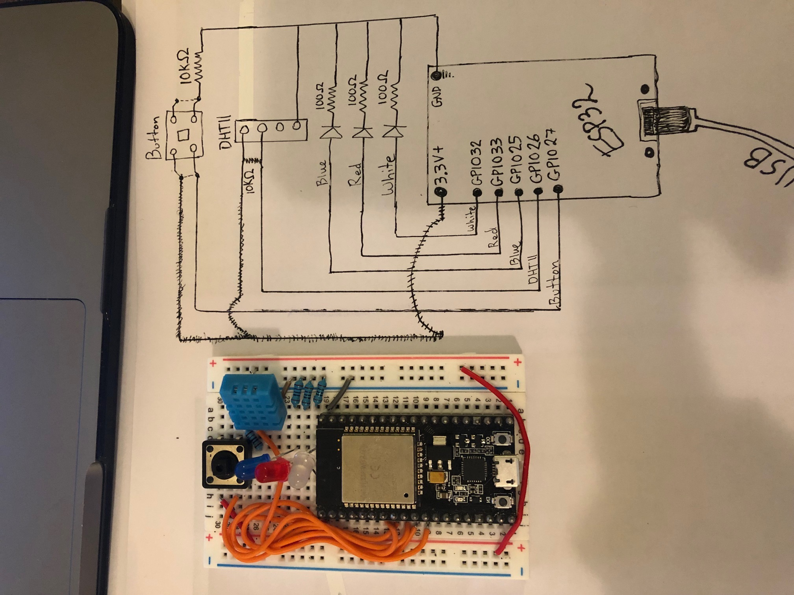

    Up-close (1): 
    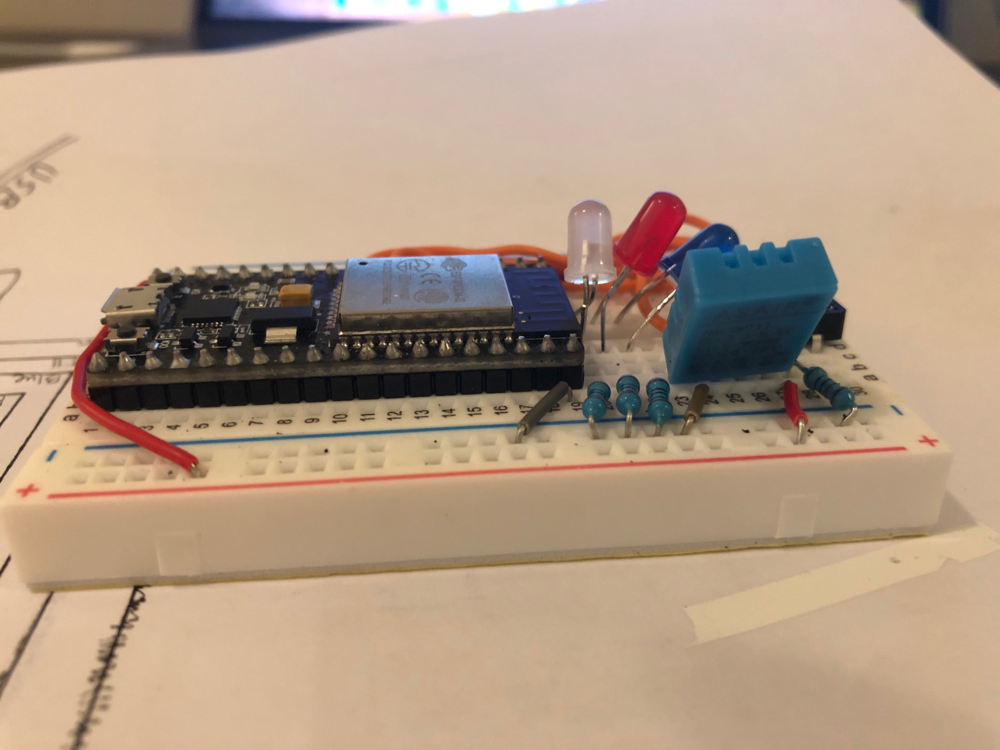

    Up-close (2): 
    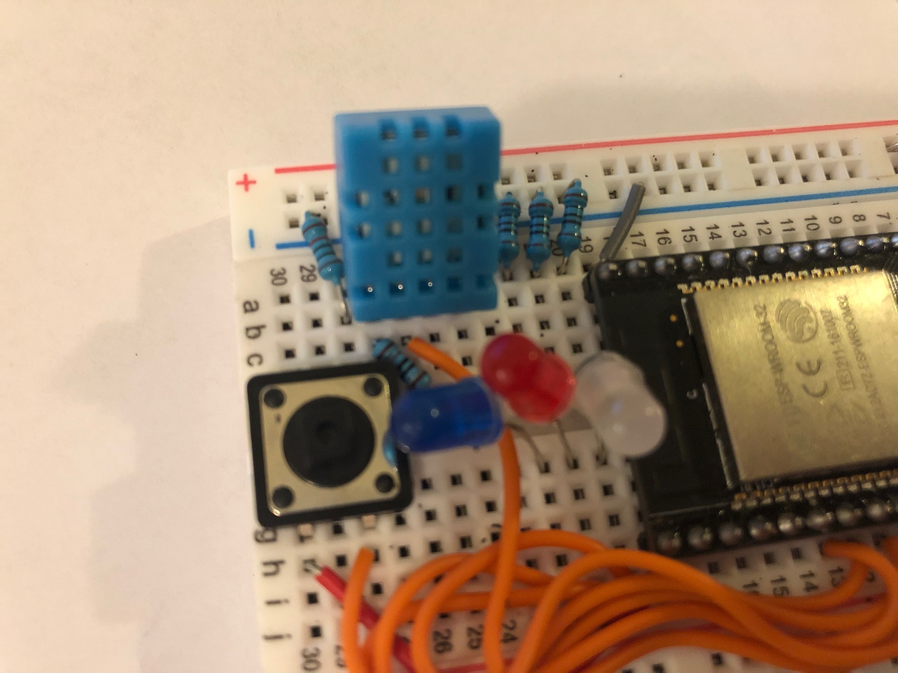

    Pinout (this is specific to my ESP32 manufacturer): 
    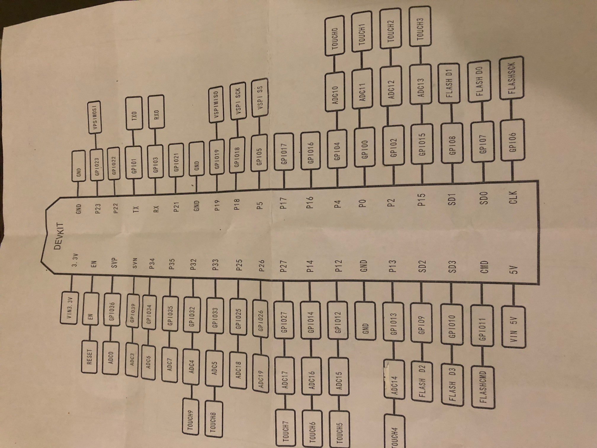

## Flash ESP32 with thermostat skill

We will flash the ESP32 with [Mongoose OS](https://mongoose-os.com/), an open-source IoT operating system. Mongoose OS (MOS) supports C/C++ and Javascript. We will be using the Javascript version in this demo.  

## Generate and Download Device Certificates

The CloudFormation template you deployed in previous steps created an AWS IoT "Thing" for you in the device registry. A registry `thing` is only a logical representation of a physical device. In order to create a link between a physical device and your thing, you must generate certificates and keys, attach them to your thing, and install them on your device. Then, when your device connects to AWS IoT Core's MQTT pub/sub broker, IoT Core will know which thing the device is based on its certificates. 

1. Navigate to the [AWS IoT registry](https://us-east-1.console.aws.amazon.com/iot/home#/thinghub).

2. Click the thing with a name similar to  `alexa-smart-home-demo-SmartHomeThing-1LW418RIHGL2X`

3. Click **Security** on the left and then click the **Create certificate** button:

    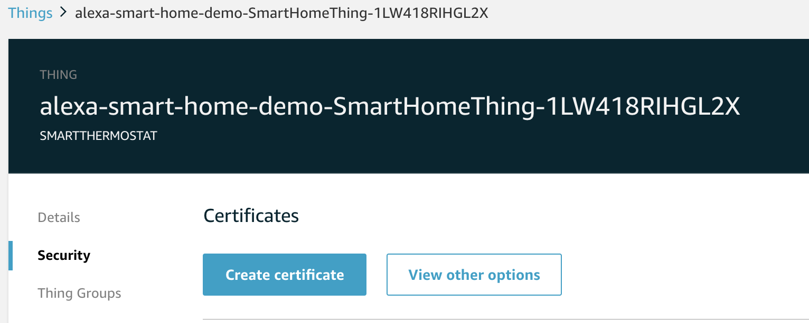

4. On the next screen, you should see a **Certificate created!** message. Follow these steps: 

    1. Download the device certificate and private key to the `esp32/fs` directory of your project repository. For this demo, you do not need to download the public key:

    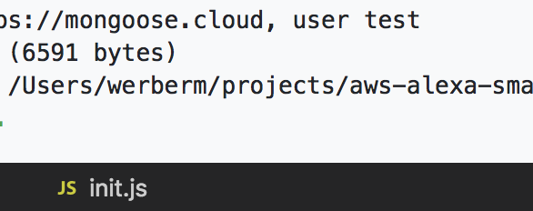

    2. Click **Activate** to activate your certificate. 

    3. Click **Attach a policy** in the lower right corner:

    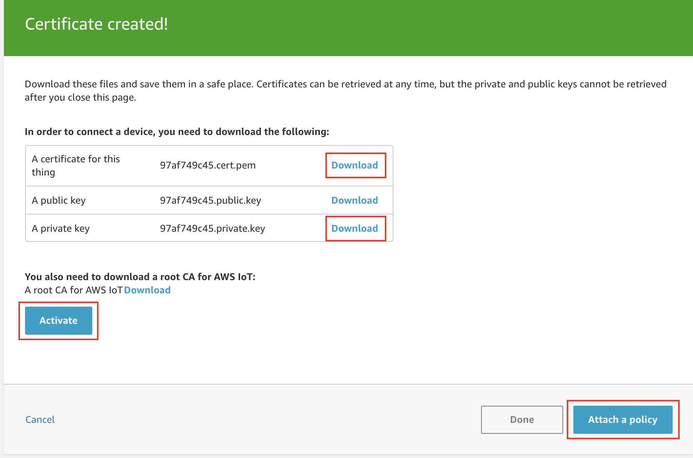

5. The CloudFormation template you launched previously has already created an IoT certificate policy for you with a name similar to `alexa-smart-home-demo-IoTThingPolicy-ABCDEFG`. Search for this policy, check the box next to it, and click **Done**:

    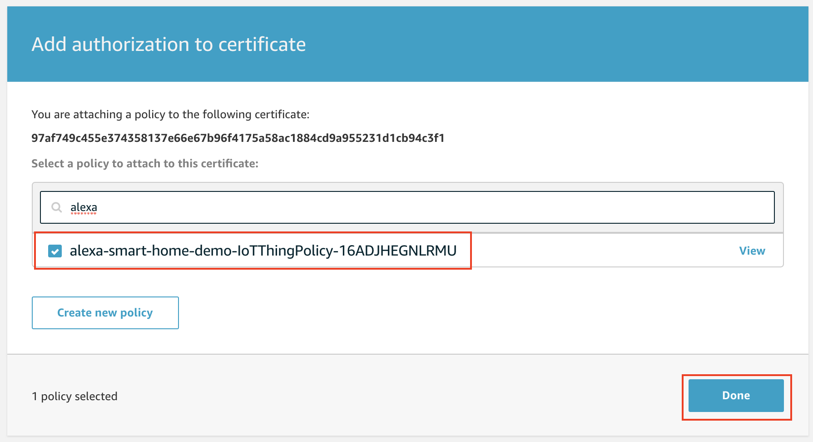

## Prepare Mongoose OS Configuration File

Before we flash your ESP32 with the thermostat code, we need to make a few changes to `/esp32/mos.yml` in your local project directory. This file controls the build process, including which libraries, environment variables, etc. that we use: 

1. From the root of your local project directory, open the file `esp32/mos.yml`

2. Within `esp32/mos.yml`, set the name of the MQTT SSL cert and SSL key to the names of the cert files you previously downloaded to the `esp32/fs` directory: 

    ```yaml
    - ["mqtt.ssl_cert", "67e48f5611-certificate.pem.crt"]
    - ["mqtt.ssl_key", "67e48f5611-private.pem.key"]
    ```

3. Within `esp32/mos.yml`, set the name of your MQTT server to your custom AWS endpoint:

    ```yaml
    - ["mqtt.server", "a2mvse6841elo7-ats.iot.us-east-1.amazonaws.com:8883"]   
    ```

    You can find your custom endpoint from your [AWS IoT Core Settings](https://us-east-1.console.aws.amazon.com/iot/home#/settings): 
    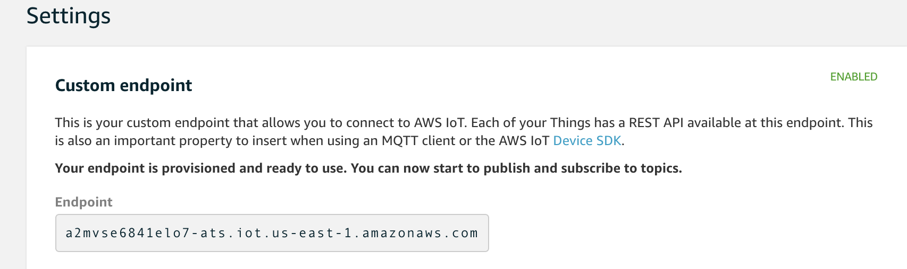

5. Within `esp32/mos.yml`, set the name of your AWS IoT thing:

    ```yaml
    - ["aws.thing_name", "alexa-smart-home-demo-SmartHomeThing-1LW418RIHGL2X"]
    ```

    Your can find your thing name from the [AWS IoT Registry](https://us-east-1.console.aws.amazon.com/iot/home#/thinghub):
    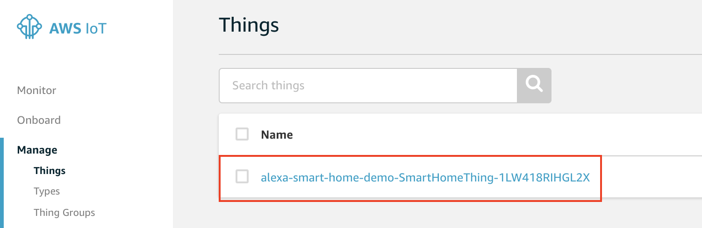

6. You can optionally uncomment the lines below and enter your WiFi SSID and password, though this step isn't required. We will later show you how to set these values wirelessly over Bluetooth: 

    ```yaml
    # - ["wifi.sta.ssid", "YOUR WIFI NAME"]
    # - ["wifi.sta.pass", "YOUR WIFI PASSWORD"]
    ```

## Flash ESP32 with Thermostat Code and AWS IoT Certificates

Now we will flash the thermostat code and AWS IoT certificates to your ESP32. If you haven't already, complete the [ESP32 First-time setup instructions](./04-esp32-first-time-setup.md), then proceed below: 

1. Plug in your ESP32 to your computer via USB

2. From a terminal, type `mos` to start the mos UI

3. Within the mos UI, navigate to the `esp32` directory of your project root: 

    ```bash
    cd path-to-project/aws-alexa-smart-home-demo/esp32
    ```

4. Within the mos UI, type `mos build` to build your project. The UI will send the contents of `mos.yml` and your `esp32/fs` directory to a Mongoose OS build server and the server will return the compiled project. You can optionally build locally (refer to Mongoose OS docs for details):

    Issue the build command:
    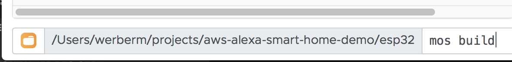

    Wait for build to complete: 
    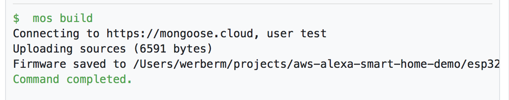

5. Within the mos UI, type `mos flash` to flash your ESP32:

    Flash in process:

    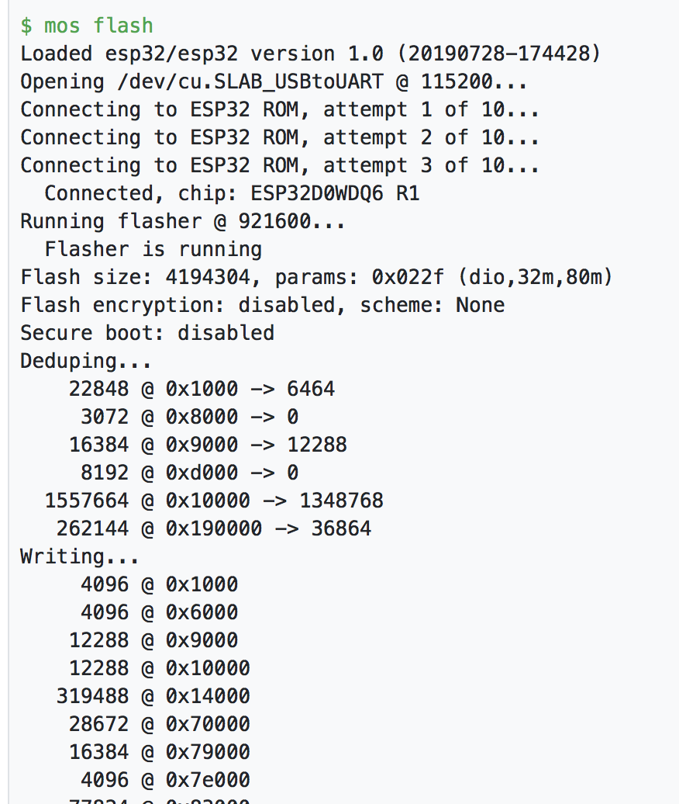

    Flash complete: 
    
    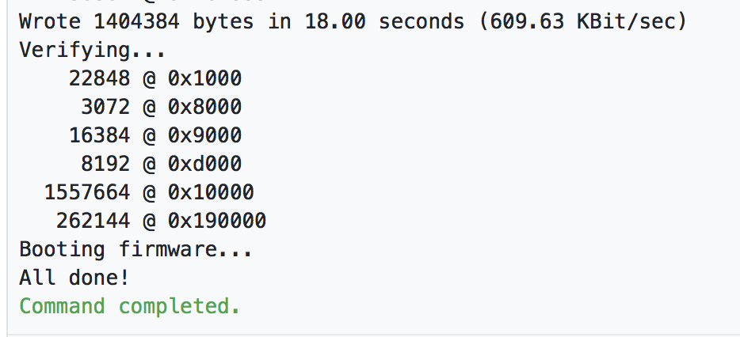

## Verify Flash was Successful

1. Once the flash completes, you should see telemetry from the ESP32 display within your MOS console:

    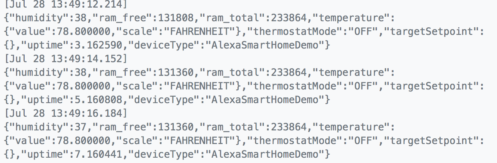

2. If you see something similar to `"temperature": { "value": 75, "scale": "FAHRENHEIT"}` and `"humidity": 37` in the telemetry, your DHT11 temp/humidity sensor is working. 

3. If you press your button on the red and blue LEDs toggle on/off, your button is working (the button does not affect the white LED):

    * Thermostat mode is HEAT: 

    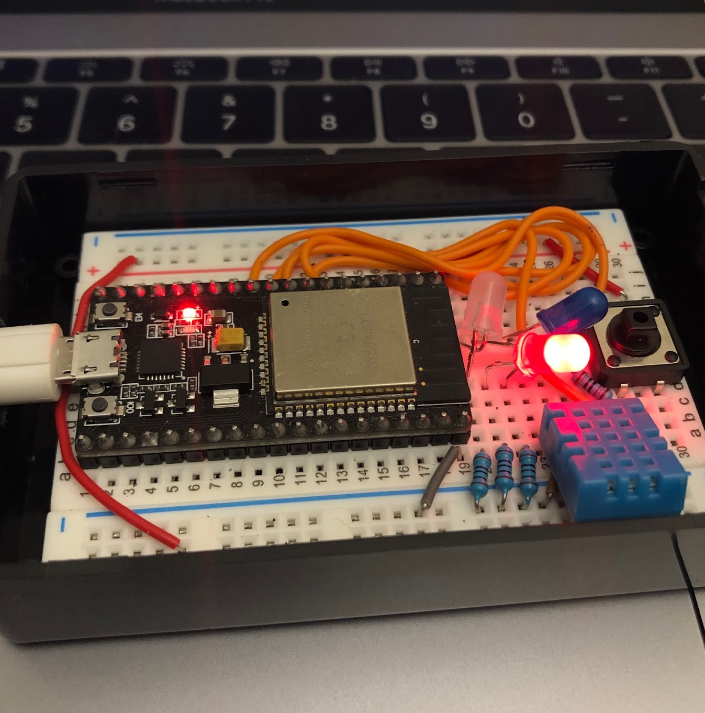

    * Thermostat mode is COOL: 

    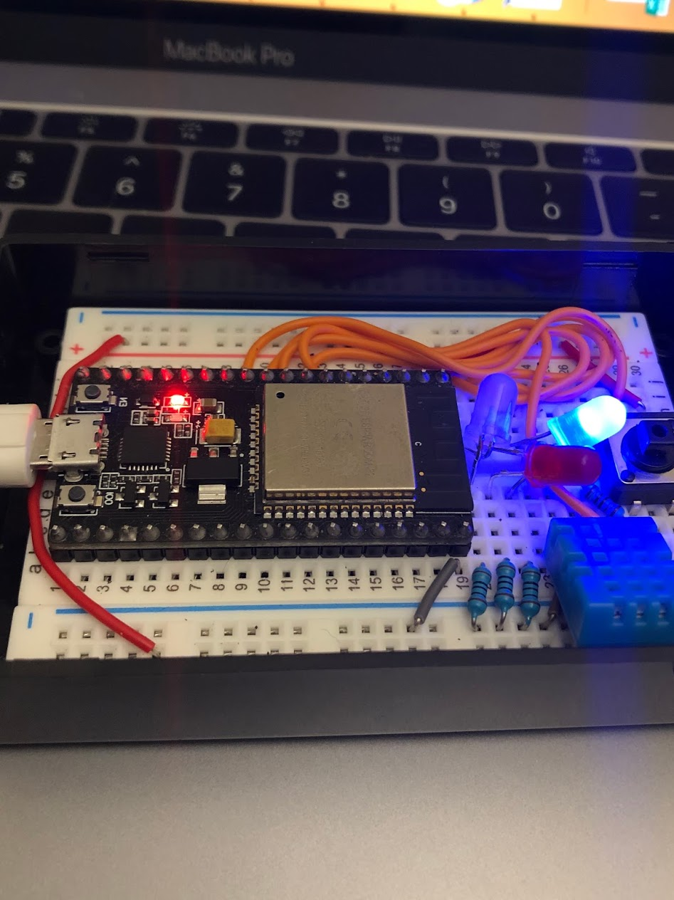

    * Thermostat mode is OFF: 
    
    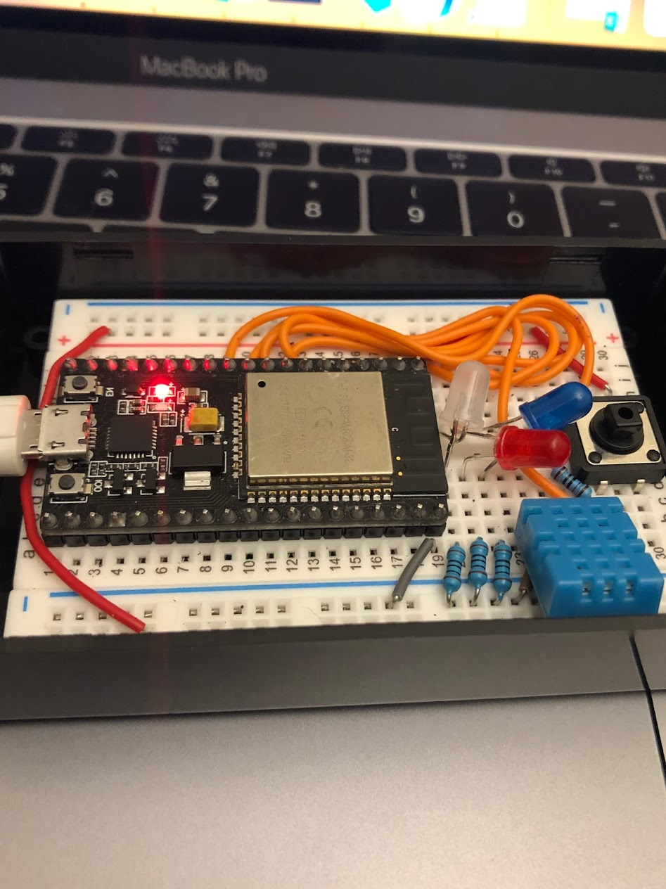

## Configure WiFi on your ESP32

If the white LED on your ESP32 is glowing solid, you are already connected to WiFi and AW IoT Core and you can skip this step. 

1. Navigate to https://mongoose-os.com/ble/#/

2. Click **Choose device** and search for and select a device with a name similar to `ESP32_B2CE5D` (your device will have a different suffix).

3. Enter your WiFi SSID and password. <mark>Note - the ESP32 I use only works with 2G WiFi</mark>. To be safe, I recommend you first test a 2G WiFi before testing 5G.

4. Click **Save WiFi settings**, and after a few moments a popup alert should say **Done!**. 

## Verify Connectivity to AWS IoT Core

If you followed all steps closely and if my instructions are correct :), then your white LED should be on and solid, meaning it is connected to both WiFi and AWS IoT Core. Congrats!

If your white LED is off, then (a) you are not connected to WiFi or (b) you are on WiFi but not connected to AWS IoT Core. 

1. You entered incorrect WiFi credentials. 
2. You entered a 5G WiFi configuration, but your ESP32 only supports 2G WiFi. 
3. You did not flash your AWS certificates to the device by including them in the `esp32/fs` directory before executing `mos build`
4. You did not activate your certificates in AWS IoT Core.
5. You did not attach a certificate policy to the certificates which allows them to connect to AWS IoT Core

To troubleshoot, open the MOS UI, plug in your device to your computer, and reboot the device. Then, carefully review the boot logs to see if there are any error messages related to WiFi or MQTT.

WiFi error messages might look like this, `WiFi STA: Connect timeout`: 

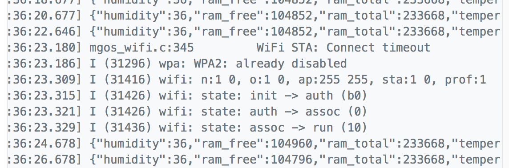

## Next Steps

Once you have your components, complete [Step 6 - Test Your Skill with an ESP32 Thermostat](./06-test-skill-with-esp32.md).
