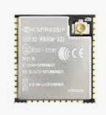
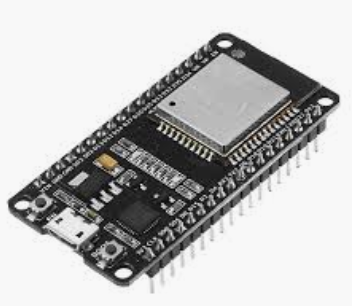

# ESP 32 Bill of Materials for Smart Thermostat Demo

Rather than buying the parts below individually, I strong recommend buying an IoT component "starter kit", as these will give you most of what you need at a typically lower cost. The IoT kits often come with many other sensors that you can use with additional projects, too. 

The one area where you **might** want to get the exact same item below is the ESP32 development board. There are many ESP32 dev boards out there, and you can likely use any one of them, but the boards often have slightly different pin layouts and capabilities. If you use the same board as me, you can use the same wiring pattern that I did. This will make things easier but its not a hard requirement. 

If you're wondering, I do not receive any form of affiliate incentive or compensation if you buy the items below.

## Parts List

1. [ESP32 Development Board](https://www.amazon.com/gp/product/B0718T232Z/ref=ppx_yo_dt_b_asin_title_o02_s01?ie=UTF8&psc=1)

2. [Breadboard](https://www.amazon.com/Qunqi-point-Experiment-Breadboard-5-5%C3%978-2%C3%970-85cm/dp/B0135IQ0ZC/ref=sr_1_13?keywords=breadboard&qid=1563661634&s=electronics&sr=1-13) - this is the size I used. Note that it was a very tight fit with just one unused row of holes in the breadboard. You may want to get a slightly longer board to allow room to breath (unless you like a challenge!). 

3. [Three LEDs of different colors, forward voltage ~2-3V, ~0.06 watts](https://www.amazon.com/Outgeek-Emitting-Assorted-Electronics-Component/dp/B07FTDWLK8/ref=sr_1_13?keywords=30+ma+led&qid=1563739605&s=gateway&sr=8-13) - I think most "electronics kit" type LEDs should be fine. I suggest at least a blue and red LED to represent the COOL and HEAT modes of our device. 

4. [Three 100-ohm 1/4 watt resistors](https://www.amazon.com/AUSTOR-Resistors-Assortment-Resistor-Experiments/dp/B07BKRS4QZ/ref=sr_1_3?keywords=resistors&qid=1563739861&s=gateway&sr=8-3)

5. [Two 10K-ohm 1/4 watt resistors](https://www.amazon.com/AUSTOR-Resistors-Assortment-Resistor-Experiments/dp/B07BKRS4QZ/ref=sr_1_3?keywords=resistors&qid=1563739861&s=gateway&sr=8-3)

6. [DHT11 temperature / humidity sensor](https://www.amazon.com/DHT-11-Digital-Temperature-Humidity-Arduino/dp/B0184Y3L4A/ref=sr_1_9?keywords=DHT11&qid=1563662201&s=gateway&sr=8-9) - Again, buy a DHT11 as part of a variety kit to save $$$$ and get other fun stuff. 

7. [TACT Switch](https://www.amazon.com/microtivity-IM206-6x6x6mm-Tact-Switch/dp/B004RXKWI6/ref=sr_1_7?keywords=tact+switch&qid=1563662373&s=gateway&sr=8-7) - really, any push-button switch should work, wiring might vary slightly. 

8. [Jumper wires](https://www.amazon.com/AUSTOR-Lengths-Assorted-Preformed-Breadboard/dp/B07CJYSL2T/ref=sr_1_2?keywords=jumper+wires+electronics&qid=1563662443&s=gateway&sr=8-2)

## ESP32 Overview in 30 seconds

The ESP32 is a popular microcontroller made by Espressif. The production version used in devices all over the world looks like this: 

We will be using an ESP32 development board, which looks like this: 

You can see that the development board also has an ESP32, but it is attached to an additional PCB that makes it easy to plug into a breadboard and experiment. 

## Electronic calculations

### LEDs

Some quick Googling suggests a lot of common hobbyist LEDs are rated for 20-30 mA (milliamps, or 0.001 amps).

Our formula is `([source voltage] - [LED forward voltage]) / resistance = amps`. Depending on the color of our LEDs, they will range from *roughly* 2-3V of forward voltage drop, and we will be using the 3.3V output from our ESP32. So we have: 

* 2V LED formula -> `(3.3V - 2V) / 100 Ohm = 13 mA`
* 3V LED formula -> `(3.3V - 3V) / 100 Ohm = 3 mA`

Per above, a 100 Ohm resistor puts us well within the safe range of an LED rated for ~20 mA.

If we instead use the 5V output from the ESP32, our formulas look like this: 

* 2V LED formula -> `(3.3V - 2V) / 100 Ohm = 30 mA`
* 3V LED formula -> `(3.3V - 3V) / 100 Ohm = 20 mA`

As you can see, 5V with a 100 Ohm resistor puts us right around (what I think?) is a common max rating (~20-30 mA) for common hobbyist LEDs.

Now, we could use 5V and just increase the resistance to bring down the amps, but the reason I chose 3.3V is that the push button I use in this project causes the input voltage to flow to an input pin on the ESP32 when the button is pressed... and I read that it **is generally not safe to use a 5V input to the ESP32 (and similar board) GPIO input pins**. By keeping my LEDs on 3.3V, I can just deal with one voltage for everything and keep the wiring more simple. 

### DHT11 Temperature/Humidity Sensor

I followed this [Adafruit guide](https://learn.adafruit.com/dht?view=all), which calls for a 10K Ohm resistor. It says that the DHT11 works with 3.3 - 5V, but sometimes 3.3V might not be enough, in which case you can do 5V (also with a 10K Ohm resistor). At least for my DHT11, 3.3V seems to work just fine. 

### Push-button to Change Thermostat Mode

One of the parts kits I bought came with the same type of buttons [described in this Tumblr guide](https://tymkrs.tumblr.com/post/19734219441/the-four-pin-switch-hooking-it-up). Refer to the guide for wiring instructions. It's ok if you have a different type of button... it just may require slightly different wiring. Again, I used a 10K Ohm resistor per guidance at https://learn.sparkfun.com/tutorials/pull-up-resistors/all.

## Next Steps

Once you have your components, complete [Step 5 - Build Your ESP32 Thermostat](./05-build-esp32-thermostat.md).