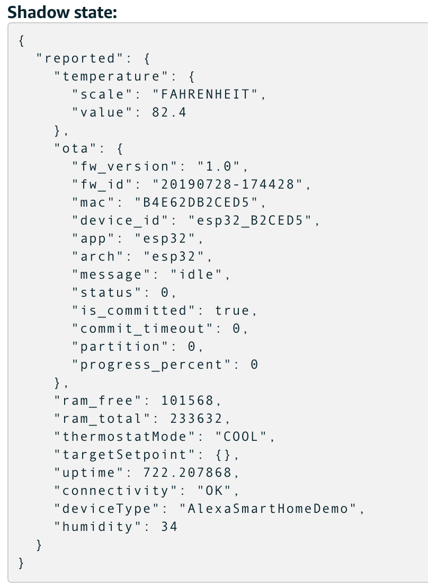

# Test Your Alexa Smart Home Thermostat Skill with an ESP32

The CloudFormation template in [template.yaml](./../template.yaml) has a `UsePhysicalDevice` parameter that has a default value of false. If this value is false, the Alexa Lambda function will not actually interact with IoT Core and will instead just send back mock responses to the Alexa service. Now that we have a functioning ESP32 tied to our IoT Thing in IoT Core, we can modify the `UsePhysicalDevice` parameter to interact with our real device:

1. Navigate to the `alexa-smart-home-demo` CloudFormation stack, choose **Update stack**, and modify the parameter **UsePhysicalDevice** to have a value of `true`; deploy your updated stack. When this parameter is `false`, the Lambda function invoked by Alexa will directly update the AWS IoT thing's reported state to match the requested state from Alexa; when set to `true`, the Lambda will only update the desired state because our assumption is that there is a physical device that will receive the state change, physically update state, and report back the new state itself.

2. Within AWS IoT, open the device shadow of your smart home's AWS Thing in the device registry and view the device shadow. If your device is connected, it may look something like this: 

    <p align="center">
        <kbd></kbd>
    </p>

3. If your ESP32 is connected (white LED on), you should see the `uptime` value incrementing in the reported state. If you blow "hot" air directly over the DHT11 for a few seconds, you should eventually see the reported `temperature` and `humidity` change.

4. Press the thermostat mode button on the ESP32 and notice that the mode (via red and blue LEDs) changes on the device and that the reported `thermostatMode` toggles between `OFF`, `COOL`, and `HEAT`.

5. Manually edit the IoT device shadow by adding the following section to the shadow document:

    Note - replace "COOL" with either "HEAT" or "OFF", if your device is already in COOL mode

    ```json
    "desired": {
        "thermostatMode": "COOL"
    }
    ```

    Save the changes and notice within the MOS terminal that the device received a message on the shadow/update MQTT topic that there is a difference between the device's reported and desired state. Note that the device then updates the device's reported state and publishes this new state to the AWS IoT shadow. 

6. Now, the fun part! Again, talk to your Alexa device but this time see how it interacts with the device to change modes, get the current temperature, or update the target setpoint:

    * "Alexa, set thermostat to COOL"
    * "Alexa, set thermostat to OFF"
    * "Alexa, what is the thermostat temperature?"
    * "Alexa, set the thermostat to 65 degrees"
    * "Aelxa, increase the thermostat temperature"
